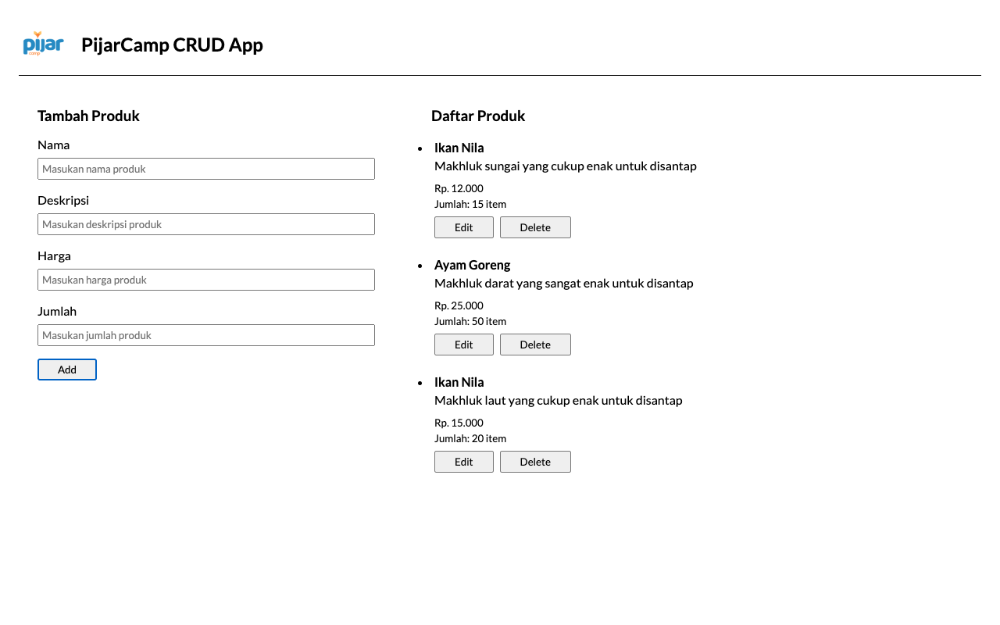

# PijarCamp CRUD App

Ini adalah tugas 10 pada level 3 untuk soal preclass Pijar Camp.

Pada soal ini diminta untuk membuat sebuah aplikasi web sederhana yang menerapkan fungsi CRUD ke database. Adapun beberapa perubahan yang saya lakukan adalah nama tabel, kolom pada tabel dan beberapa bagian kecil lainnya yang sudah disesuaikan.

Nama tabel: products

Nama kolom:

- id
- name
- description
- price
- qty

RDBMS yang digunakan adalah MariaDB dengan menggunakan akun seperti berikut.

- host: localhost
- user: root
- password: (kosong)
- database: pijarcamp

Database dihubungkan ke aplikasi melalui flag "-dsn" dan berikut adalah contoh dari dsn yang digunakan.

```
root:@/pijarcamp
```

## Tampilan Aplikasi


